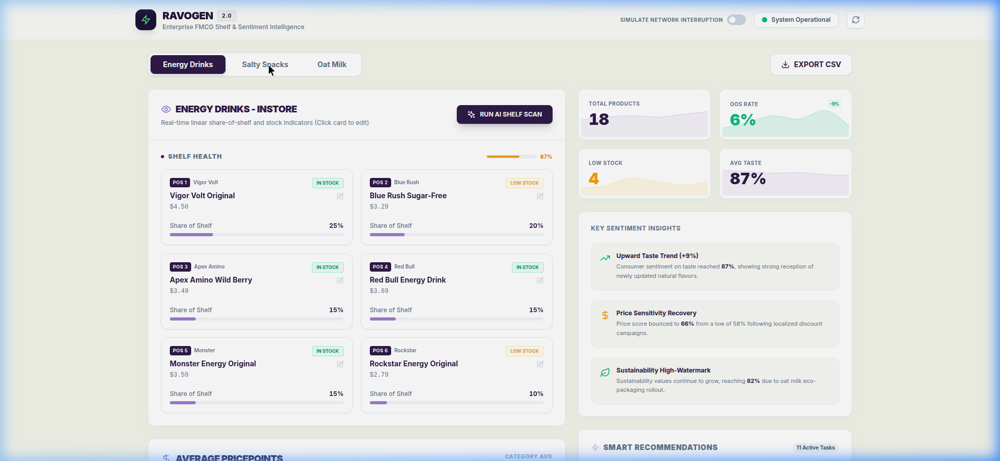

# Ravogen Shelf Analyzer Prototype



Welcome to the technical documentation manual for the Ravogen Shelf Analyzer prototype. This monorepo implements a full-stack, enterprise-grade FMCG data analytics system designed to track in-store shelf configuration, analyze competitive pricing, and simulate AI machine vision workflows.

> [!TIP]
> **Check out the animated demo of the interactive features below:**
> 

---

## 1. Executive Product Overview

Ravogen is an enterprise FMCG data analytics platform specializing in real-time machine vision shelf intelligence. By translating visual shelf conditions into high-impact business metrics, Ravogen enables brands to gain immediate store visibility, streamline audits, and maximize retail execution.

### Core Value Proposition
- **Share of Shelf & Faces Tracking**: Automatically measures linear occupancy and physical share of face listings to monitor category presence.
- **Price Point Analysis**: Aggregates real-time shelf pricepoints and exposes competitive price trends.
- **Out of Stock (OOS) Status Audits**: Flag and alert operations immediately when inventory drops to "Low Stock" or "Out of Stock" status.
- **Actionable Insights Engine**: Translates raw data changes into structural summaries (e.g. Taste Sentiment Trends, Sustainability indicators, and Price Sensitivity analysis).

---

## 2. Architectural Blueprint (The Monorepo)

This project is orchestrated using an **npm workspaces** monorepo layout, dividing concerns across three main layers:

```
ravogen-monorepo/
├── packages/
│   ├── shared/         # Domain contracts, schemas, and type-safety definitions
│   ├── backend/        # Express REST API & Mock Data Processing Engine
│   └── frontend/       # React + Vite + Tailwind Single-page Dashboard
├── package.json        # Workspaces coordinator configuration
└── README.md           # Product documentation manual
```

### Subsystems Breakdown
- **`shared`**: Domain-level TypeScript definitions. Contains data contracts like `ShelfItem`, `SentimentSnapshot`, and `OosStatus` shared natively across the boundaries of client and server to prevent contract drifts.
- **`backend`**: Node.js, Express, and TypeScript in-memory data engine. Features routes for fetching shelf inventory, toggling test scenarios, streaming reports, and performing mock analysis sweeps.
- **`frontend`**: Single-view React client bootstrapped via Vite. Utilizes Tailwind CSS for UI presentation and Recharts for data telemetry widgets and comparative bar charting.

---

## 3. Core Engineering Features Implemented

### Synchronized Single-View Dashboard
The dashboard uses a consolidated 3-column responsive layout layout to maximize vertical screen efficiency:
- **Category Filter Menu**: Allows category-based switching ("Energy Drinks", "Salty Snacks", "Oat Milk") directly updating active datasets.
- **60/40 Split-Panel View**:
  - *Left Column (60% width)*: Renders the active category's SKU inventory cards side-by-side with a constrained (`h-[320px]`) competitive "Average Pricepoints" Bar Chart.
  - *Right Column (40% width)*: Integrates live KPI telemetry widgets alongside the "Key Takeaway" box.

### Smart Action Recommendations Center
A real-time logic engine that processes inventory datasets and issues actionable tasks:
- **OOS / Low Stock Routing**: Flags depleted products and generates quick-action REST dispatch buttons.
- **Price Optimization Algorithms**: Identifies shelf items deviating significantly (15%+) from category averages and provides a 1-click price alignment update.
- **Category Audits**: Issues critical bulk-restock recommendations when category health falls below 70%.

### Interactive Product Editor Drawer
- **Sidebar Integration**: Clicking any product on the dashboard grid smoothly slides open a right-side drawer containing a product modifier form.
- **Live State Mutation**: Emits HTTP `PUT` requests to the backend to manipulate pricing and out-of-stock statuses, instantly updating the frontend React state, chart displays, and recommendation queues.

### Dynamic Telemetry & Sentiment Generation
The dashboard continuously evolves during usage instead of relying strictly on static stubs:
- **Dynamic KPI Delta Badges**: Real-time evaluation of `totalItems`, `oosRate`, and `lowStockItems` rendering contextual delta badges (e.g., `+5%` or `-2%`).
- **Simulated Machine Vision Output**: Scanning the shelf mutates inventory and dynamically drifts the aggregated taste, price, and sustainability sentiment scores.

### Simulation Laser Scan Engine
Replicates a real-time computer vision hardware sweep over physical store inventory:
- Triggered by the "Run AI Shelf Scan" action.
- Sweeps a vertical purple laser line animation (`animate-scan`) down the height of the product grid.
- Overlays dynamic target-lock bounding boxes and flashing analysis confidence intervals over cards specifically aligned with the laser scan position.

### Background CSV Data Pipeline
Exposes data exports without disrupting operational workflows:
- Resolves previous window redirection bugs by executing an asynchronous `fetch` call to the streaming backend endpoint.
- Reads the response as a native JavaScript `Blob` and generates a local Object URL.
- Automatically clicks a programmatically generated anchor element to start a silent, background download of the CSV report.

### Resilient Failure Boundaries (Chaos Mode)
Incorporates testing controls to guarantee frontend recovery:
- **Simulate Network Interruption Switch**: Toggles `isChaosModeActive` on the backend.
- **Graceful Error Recovery**: Instantly flags the connection status dot to red ("API Offline / Interrupted"), bypasses active laser sweep animations, and fires a high-contrast toast banner containing server timeout data.

---

## 4. Local Quickstart Guide

Ensure you have Node.js (v18+) and npm installed on your system.

### Installation
From the root workspace directory, run:
```bash
npm install
```

### Dev Mode Quickstart
Boot both the frontend and backend servers concurrently:
```bash
npm run dev
```

### Port Mappings
- **Backend API**: Running on **`http://localhost:5001`** (express router serves endpoints under `/api`).
- **Frontend Dashboard**: Booted on **`http://localhost:3000`** via Vite.

*Note: Depending on environment overrides, the ports can fallback to default Vite (`5173`) and default Express (`3001`).*

### Building for Production
Validate types and compile the optimized production distribution bundles:
```bash
npm run build
```
